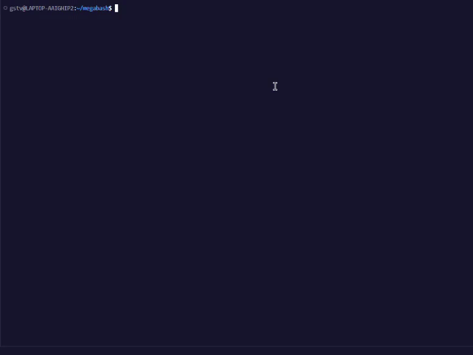

<div align="center">

  # megabash 😎👍

  

<div  align="left">
<h2>About</h2>
In computing, a shell is a computer program that exposes an operating system's services to a human user or other programs.
<br />
This project is about creating a simple shell and learn a lot about processes and file descriptors!
<br />
</div>
<br />
</div>
<h2>Preview</h2>
  
<div>
<br />

</div>

## How to use

1. Clone this repository on your terminal.
```bash
git clone https://github.com/gustavdlima/megabash/
```

2. Access `megabash` repository on your computer and compile the program.
```bash
cd megabash && make
```

3. We're ready to begin!
```bash
./minishell
```

4. Won't use it anymore? Here you go!
```bash
make fclean
```

<br /><br /><br /><br /><br /><br /><br />
Made by [gustavdlima](https://github.com/gustavdlima/) and [julianamilson](https://github.com/julianamilson/).

Special thanks to our village members: [rodsmade](https://github.com/rodsmade), [Leticia-Franca](https://github.com/Leticia-Franca), [carlalrfranca](https://github.com/carlalrfranca), [adrianofaus](https://github.com/adrianofaus)!
